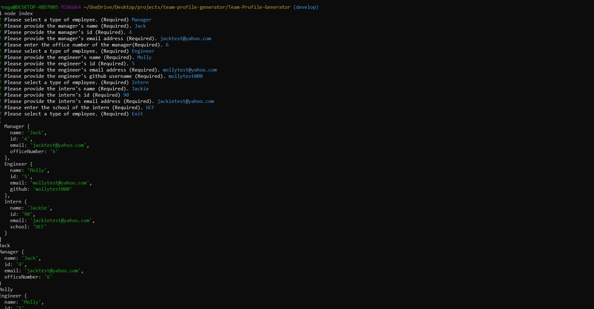
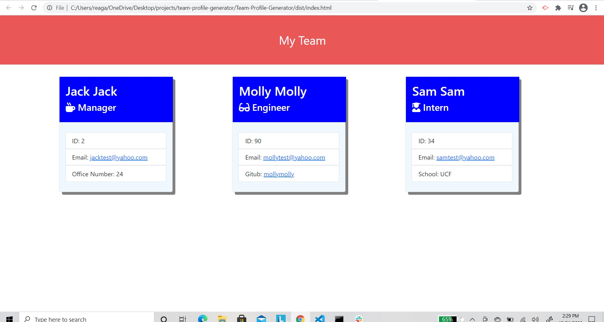

[]

  # Team-Profile-Generator 

  ## Description
  - A generated HTML page that provides summaries for different employee types using user input from node.js command line. 

  ## Table of Contents
  * [Installation](#installation)
  * [Usage](#usage)
  * [Credits](#credits)
  * [License](#license)
  * [Contributing](#Contributing)
  * [Test](#test)
  * [Questions](#questions)
  

  ## Installation
  1. Create a folder on your local pc and clone this repo down.
  2.Install the lastest version of node.js
  3. run the command npm install.
  4. Install jest package by running the command: 'npm install --save-dev jest'
  5. Open up your package.json and check to see if script test has a value of "jest" (include the quotations), if not change it. This is needed if you want to add test of your own. To run a test please vist the * [Test](#test) section. 
  6. Open your terminal and run the command 'node index.js'. 
  7. Answer the prompts to build your team profiles.
  8. Open the dist/ folder 
  9. Right click on the index.html that was generated to Open in Default browser.
  10. There you have it, You generated your team's profiles from the command line. 

  ## Usage
  You would use this command line application to generate a quick profile of your employee team as well as have quick access to it. 
   
  
   
  This is what the generated html file should will look like in the broswer.
   
  
   
  A walkthrough link depicting the process: https://www.youtube.com/watch?v=Ct6hzEAVkug&feature=youtu.be

  ## Credits
  N/A

  ## License
  This licence is covered undered (https://opensource.org/licenses/ISC).
  

  ## Contributing 
  Currently no credits are applicable for this project.

  ## Test
  All test for this application were successfully passed. In the test folder when this repo is cloned locally to your pc, try adding another employee type. For instance, add a 'Associate.test.js' file to the _test_ folder. Using the jest package, write a test that creates a new instance of associate and expect that associate to be an object. Run the command 'npm run test or npm run test <filename> to have the test run. Initially that test should fail which is what you want. Create an Associate.js file in the lib/ folder and make sure Associate is exported. This should now give you a passing test. You will repeat this process with every new piece of information added to the Associate.js file. For an example, look through the other test provided in the _test_ folder.  

  ## Questions
  If you have any additional questions, please reach out to me. 
  You can reachout to me at my GitHub profile, which is [reaganjoseph26](https://github.com/reaganjoseph26).
  Also, you can reach out to me by email. My email address is reaganjoseph26@yahoo.com. 
  